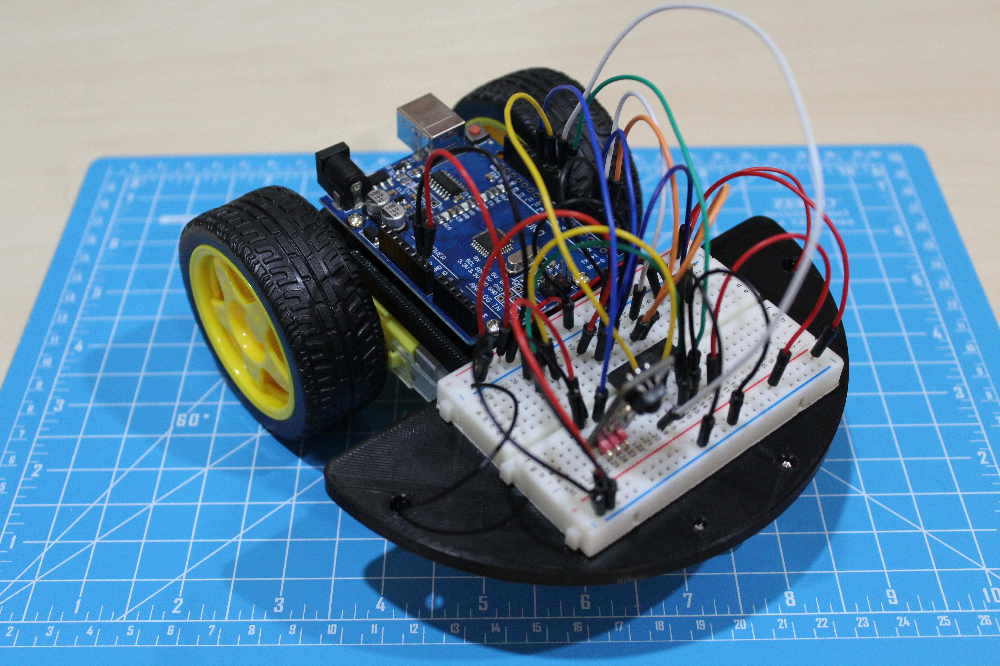
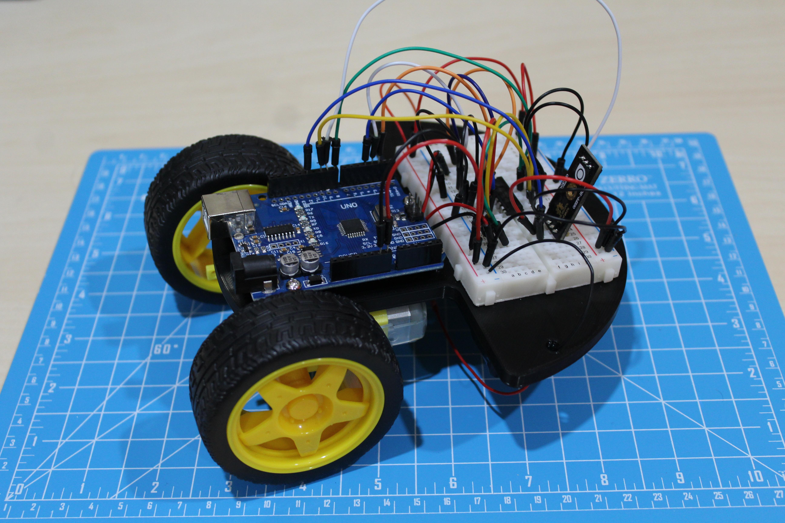
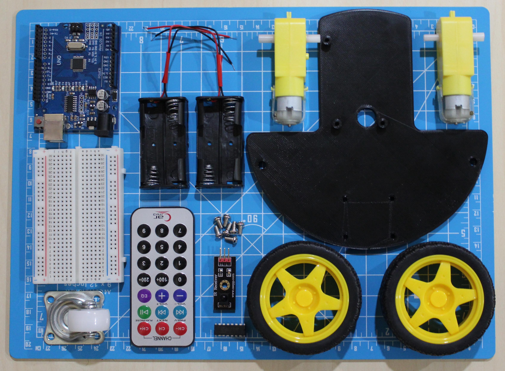
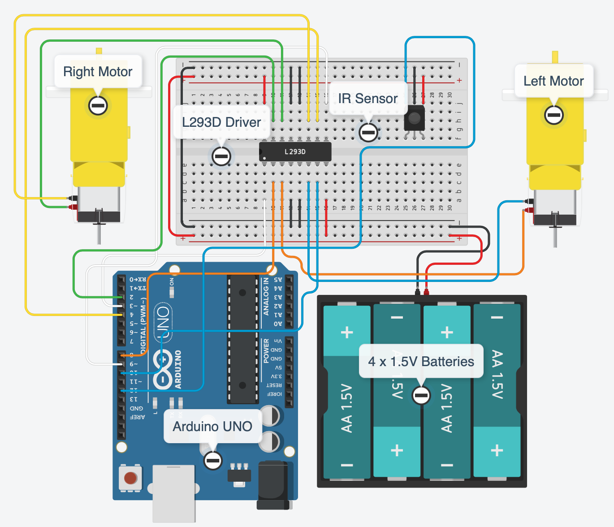

# Remote-Control-Arduino-Car

A great introductory project for those diving into the IoT and Arduino platform. Working with motors and an IR sensor helps newbies understand various components and sensors compatible with the Arduino. Using the remote control, you will be able to control the robot's movement allowing the robot to move in straight lines or turn based on human input. Incoporating 3D design, 3D printing, microprocessor technologies and coding, it is an excellent project for beginners looking to get into robotics. 

Learn more about the procedures on [Instructables](https://www.instructables.com/Remote-Control-Arduino-Car/)!

  
  
  
  

Feel free to connect with me on any of the following platforms to talk about question, possible collaborations, opportunities, events, tech, or for fun!! Can't wait to meet you!

  

  

  

  

